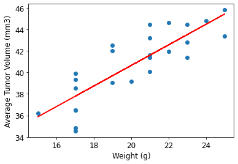

# Pharmaceutical Study Analysis

## Description
This project is designed to provide a comprehensive high-level summary of pharmaceutical study results through advanced analysis and visualization techniques. By delving into the performance of various drugs, the project aims to distill complex study data into clear and meaningful insights. 

The analysis is performed based on study results of the potential treatments for squamous cell carcinoma (SCC), a commonly occurring form of skin cancer, for different regimens. In the study, 249 mice who were identified with SCC tumors received treatment with a range of drug regimens. Over the course of 45 days, tumor development was observed and measured. The purpose of this project is to compare the performance of companies drug of interest, Capomulin, against the other treatment regimens.

## Python Libraries Used
- Pandas
- Matplotlib

## File Structure
### Pymaceuticals
- 'pymaceuticals.ipynb': Jupyter Notebook with python script that uncovers trends in data and visualizes the findings.

### data
    - 'Mouse_metadata.csv': CSV file with information about study subjects, including Mouse ID, Drug Regimen, Sex, Age_months, Weight (g).  
    - 'Study_results.csv': CSV file with information about study results, including Mouse ID, Timepoint, Tumor Volume (mm3), Metastatic Sites.

## Data processing steps
Script allows to perform the following steps of the analysis:

- Prepare the data.
- Generate summary statistics.
- Create bar charts and pie charts.
- Calculate quartiles, find outliers, and create a box plot.
- Create a line plot and a scatter plot.
- Calculate correlation and regression.
- Submit your final analysis.

## Results

The experiment was performed on 249 mise. Analysis was performed on the 248 testing records (1 mouse testing result was excluded from the analysis dues to wrong entry).  
51% of the mice were Males and 49% - Females. 

The data was collected form the test results of 10 different regimens:
- Capomulin,
- Ceftamin,
- Infubinol,
- Ketapril,
- Naftisol,
- Placebo,
- Propriva,
- Ramicane,
- Stelasyn,
- Zoniferol.
The number of observed Mouse Timepoints vary for different regimens.

#### Capomulin Results

For the mice treated with Capomulin there is strong correlation between mouse weight and the average tumor volume - 84%.
The more the Weight is, the bigger the Average Tumor Volume. 

#### Observations for Mouse ID l509
Mouse ID l509 was treated with Capomulin.
Over 45 Mouse timepoints the TUmor Volume reduced by 8% from 45 mm3 to 41.38 mm3.

